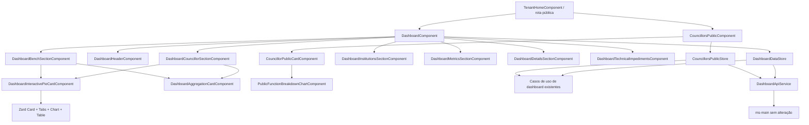

# Especificação técnica

## Resumo

A migração será implementada exclusivamente em `municipalize-app`, preservando os casos de uso, repositories HTTP, endpoints, rotas, autorização e modelos de domínio existentes. As páginas atuais serão reduzidas a shells de composição e o estado coordenado ficará em stores fornecidos no escopo das telas. Blocos visuais e interações serão extraídos para componentes pequenos, standalone e `OnPush`, compostos com os componentes Zard já instalados. Não haverá alteração em `ms-main`, banco de dados, contratos HTTP, `src/styles.css` ou `src/app/shared/`.

As agregações de vereadores e bancadas adotarão o padrão interativo aprovado: cada seção terá abas Zard de `Destino` e `Origem`; o fluxo selecionado alimentará conjuntamente totalizadores, quantidades, gráfico de pizza, cards, legendas e detalhamento por função. No cabeçalho do card, dois totalizadores acionáveis permitirão escolher se o gráfico representa quantidade ou valor financeiro, sem misturar unidades. A seleção de fluxo passará a alcançar toda a seção, substituindo o comportamento atual que altera somente o detalhamento. A listagem pública de vereadores aplicará a mesma regra aos indicadores e ao detalhamento de cada card.

Os gráficos atuais baseados diretamente em `ng2-charts` serão substituídos pelo `z-chart` já instalado, com tokens `--chart-*`, tooltip, padrões não cromáticos do ECharts, suporte a redução de movimento e alternativa tabular visível por accordion. `chart.js`, `ng2-charts` e o provider global correspondente permanecerão instalados porque ainda são consumidos pelo dashboard de LOA, fora deste escopo. Cards, tabelas, avatares, badges, abas, botões, accordions, tooltips, skeletons, estados vazios, alertas, sheets e toasts usarão suas APIs Zard existentes.

Premissas explícitas adotadas após a exploração:

- uma falha em um perfil individual não derruba toda a listagem: os dados agregados permanecem visíveis, a degradação é comunicada por `z-alert` e uma nova tentativa recarrega o enriquecimento;
- o `FunctionBreakdownBarsComponent` legado continuará no perfil público detalhado, que está fora do escopo; as duas telas migradas usarão uma nova composição Zard no ancestral comum `tenant/public`;
- a equivalência será automatizada com fixtures congeladas dos contratos atuais e confirmada no QA com um tenant e snapshot de teste, sem registrar dados pessoais nas evidências;
- todos os componentes Zard necessários já existem no projeto, portanto nenhuma execução de `zard-cli add` é prevista.

## Arquitetura do sistema

### Visão dos componentes



| Componente | Situação | Responsabilidade |
|---|---|---|
| `DashboardComponent` | Modificar | Tornar-se shell de composição, fornecer `DashboardDataStore` e manter o template abaixo de 120 linhas. |
| `DashboardDataStore` | Novo | Coordenar flows independentes de vereadores e bancadas, agrupamento detalhado, resources, revisão de refresh e recarga após snapshot. |
| `dashboard-view-models.ts` | Novo | Declarar somente os contratos imutáveis de apresentação compartilhados pela feature. |
| `BuildDashboardAggregationCardsUsecase` | Novo, co-localizado | Normalizar agregações em cards, métricas e subinstituições sem alterar valores. |
| `BuildDashboardChartViewUsecase` | Novo, co-localizado | Construir totalizadores, dados de pizza, configuração semântica e linhas da alternativa tabular. |
| `BuildTechnicalImpedimentsViewUsecase` | Novo, co-localizado | Deduplicar linhas atuais, remover HTML da prévia e manter impedimentos separados do resumo geral. |
| `DashboardHeaderComponent` | Novo | Exibir título, explicação e ação administrativa de snapshot com `z-button` e `ZardSonnerService`. |
| `DashboardCouncillorSectionComponent` | Novo | Compor tabs de flow, card interativo, legenda, cards por vereador e detalhamento por função. |
| `DashboardBenchSectionComponent` | Novo | Compor tabs de flow, card interativo, legenda, cards por bancada e detalhamento por função. |
| `DashboardInteractivePieCardComponent` | Novo | Implementar o padrão aprovado com Zard Card, totalizadores selecionáveis, `z-chart` de pizza e tabela equivalente. |
| `DashboardAggregationLegendComponent` | Modificar/substituir | Trocar badges com papel de botão por `z-toggle-group` múltiplo, mantendo ocultar, reexibir e restaurar todos. |
| `DashboardAggregationCardComponent` | Novo | Exibir identidade, valor, quantidade e breakdown para vereador ou bancada usando Zard Card. |
| `DashboardInstitutionsSectionComponent` | Novo | Exibir total geral, métricas individual/bancada e subinstituições em cards e accordions Zard. |
| `SummaryCardsComponent` | Modificar | Renderizar o resumo com composição Zard Card e tokens semânticos, sem paleta Tailwind arbitrária. |
| `DashboardChartCardComponent` | Substituir `BarChartCardComponent` e `DonutChartCardComponent` | Renderizar bar/pie com `z-chart`, loading/vazio/erro e alternativa tabular. |
| `DataTableComponent` | Modificar | Usar `z-table` em contêiner com rolagem interna e accordion para subinstituições, preservando todos os agrupamentos atuais. |
| `DashboardTechnicalImpedimentsComponent` | Novo | Isolar resumo, lista, preview do motivo e abertura do detalhe com estados próprios. |
| `CouncillorsPublicComponent` | Modificar | Tornar-se shell de listagem, fornecer store e manter abertura do perfil por Sheet. |
| `CouncillorsPublicStore` | Novo | Carregar agregações pelo flow ativo, enriquecer perfis, carregar breakdowns e expor degradação parcial e retry. |
| `BuildPublicCouncillorCardsUsecase` | Novo, co-localizado | Mapear agregação e perfil opcional para o contrato de card, inclusive iniciais e badges. |
| `CouncillorPublicCardComponent` | Novo | Usar Zard Card, Avatar com fallback, Badge, indicadores, breakdown e ações acessíveis. |
| `PublicFunctionBreakdownChartComponent` | Novo em `tenant/public/components/` | Substituir as barras artesanais somente nas duas telas em escopo por Zard Chart e alternativa tabular. |
| `CouncillorPublicProfileComponent` | Reutilizar | Continuar abrindo no mesmo `ZardSheetService`, sem reformular seu conteúdo interno. |
| Use cases, entidades e repositories de dashboard | Reutilizar | Continuar sendo as únicas fronteiras de dados; nenhum HTTP será movido para components/stores. |

Fluxo de dados das seções com Origem/Destino:

1. A tab Zard emite a seleção `DESTINATION` ou `ORIGIN`.
2. O container valida a enum e chama `DashboardDataStore.selectCouncillorFlow`, `selectBenchFlow` ou `CouncillorsPublicStore.selectFlow`.
3. O `resource` recalcula parâmetros com `flow`, `groupBy`, tipo de emenda, snapshot e `excludeStatus` já usados pela tela.
4. Agregação e breakdown usam o mesmo flow e a mesma data de snapshot; enquanto um novo conjunto carrega, a seção mostra skeleton e não reaproveita valores do flow anterior.
5. Os builders produzem totalizadores, dados do gráfico, tabela textual e cards a partir da mesma resposta imutável.
6. A seleção `amount` ou `count` troca apenas a métrica do gráfico, mantendo o flow e os dados originais.
7. Uma recarga por erro afeta somente o resource correspondente; o refresh após snapshot incrementa uma revisão compartilhada e recarrega também os breakdowns.

## Design de implementação

### Principais interfaces

```text
DashboardDataStore
  selectCouncillorFlow(flow: DashboardFlow) -> void
  selectBenchFlow(flow: DashboardFlow) -> void
  selectTableGroup(group: DashboardGroupBy) -> void
  reload(resource: DashboardResourceKey) -> void
  reloadAll() -> void

BuildDashboardChartViewUsecase
  execute(input: DashboardChartViewInput) -> DashboardInteractiveChartViewModel

CouncillorsPublicStore
  selectFlow(flow: DashboardFlow) -> void
  reloadList() -> void
  reloadBreakdown() -> void
```

Os stores serão `@Service()` sem `providedIn: 'root'` e serão fornecidos pelos respectivos shells. Isso impede que estado de flow, legenda, erro ou snapshot sobreviva à troca de rota, usuário ou tenant. Signals graváveis serão privados ou limitados a operações nomeadas; a UI consumirá somente signals readonly e `computed`.

`resource` será usado somente para leituras. O POST de snapshot continuará em método assíncrono explícito, sem retry automático. A ação usará `zLoading` e `zDisabled`, bloqueará clique concorrente na mesma instância e, após sucesso, chamará `reloadAll()`.

### Modelos de dados

Os contratos de domínio e API continuam inalterados. Os tipos novos abaixo pertencem somente ao `presenter` e nunca serão enviados ao backend.

#### `DashboardAggregationParams` — parâmetros existentes de agregação

| Campo | Tipo | Obrigatório | Descrição |
|---|---|---:|---|
| `groupBy` | `DashboardGroupBy` | sim | Dimensão da agregação. |
| `flow` | `DashboardFlow` | não | `DESTINATION` ou `ORIGIN`; nas seções interativas será sempre explícito. |
| `excludeStatus` | `AmendmentStatus` | não | Mantém impedimento técnico fora dos indicadores gerais. |
| `amendmentType` | `AmendmentType \| 'TODOS'` | não | Restringe individuais ou bancada quando aplicável. |
| `snapshotDate` | `string` | não | Data já aceita pelo contrato vigente. |
| demais filtros | tipos atuais | não | Permanecem disponíveis sem alteração de semântica. |

```text
{
  "groupBy": "COUNCILLOR",
  "flow": "ORIGIN",
  "excludeStatus": "TECHNICAL_IMPEDIMENT",
  "amendmentType": "INDIVIDUAL"
}
```

#### `DashboardAggregation` — resposta existente de uma categoria

| Campo | Tipo | Obrigatório | Descrição |
|---|---|---:|---|
| `id` | `number \| null` | sim | Identificador quando a categoria possui entidade associada. |
| `label` | `string \| null` | sim | Rótulo principal. |
| `code` | `string \| null` | sim | Código ou subtítulo existente. |
| `extra` | `string \| null` | sim | Informação complementar existente. |
| `total` | `number` | sim | Total financeiro da categoria no flow solicitado. |
| `individualCount` | `number` | sim | Quantidade de emendas individuais. |
| `individualTotal` | `number` | sim | Valor de emendas individuais. |
| `benchCount` | `number` | sim | Quantidade de emendas de bancada. |
| `benchTotal` | `number` | sim | Valor de emendas de bancada. |
| `subInstitutions` | `DashboardSubInstitutionAggregation[]` | sim | Detalhes de subinstituições. |
| `snapshotDate` | `string` | sim | Data do snapshot da resposta. |

```text
{
  "id": 42,
  "label": "Maria da Silva",
  "code": "ABC",
  "extra": "Partido Exemplo",
  "total": 1250000,
  "individualCount": 14,
  "individualTotal": 1250000,
  "benchCount": 0,
  "benchTotal": 0,
  "subInstitutions": [],
  "snapshotDate": "2026-08-20"
}
```

> **Lista vazia:** `[]` representa ausência de dados para a combinação de flow e filtros; não será tratada como erro.

#### `DashboardBreakdownViewModel` — detalhamento de função no mesmo flow

| Campo | Tipo | Obrigatório | Descrição |
|---|---|---:|---|
| `ownerId` | `number` | sim | ID do vereador ou bancada. |
| `flow` | `DashboardFlow` | sim | Flow usado na consulta. |
| `snapshotDate` | `string \| null` | sim | Snapshot alinhado à agregação. |
| `functions` | `DashboardBreakdownMetricViewModel[]` | sim | Funções e valores ordenados. |
| `subfunctions` | `DashboardBreakdownMetricViewModel[]` | sim | Subfunções quando exibidas. |

```text
{
  "ownerId": 42,
  "flow": "ORIGIN",
  "snapshotDate": "2026-08-20",
  "functions": [
    { "id": 10, "code": "10", "description": "Saúde", "total": 450000 }
  ],
  "subfunctions": []
}
```

#### `DashboardInteractiveChartViewModel` — card interativo aprovado

| Campo | Tipo | Obrigatório | Descrição |
|---|---|---:|---|
| `title` | `string` | sim | Título da agregação. |
| `description` | `string` | sim | Contexto do conjunto e do flow. |
| `flow` | `DashboardFlow` | sim | Tab ativa. |
| `metric` | `'amount' \| 'count'` | sim | Totalizador que determina a série do gráfico. |
| `totalizers` | `DashboardTotalizerViewModel[]` | sim | Quantidade e valor financeiro totais. |
| `chartData` | `ZardChartDatum[]` | sim | Categorias visíveis da pizza. |
| `chartConfig` | `ZardChartConfig` | sim | Rótulos e tokens `var(--chart-*)`. |
| `series` | `ZardChartSeries[]` | sim | Uma série por vez, evitando misturar unidades. |
| `rows` | `DashboardChartRowViewModel[]` | sim | Alternativa tabular com os mesmos dados essenciais. |
| `ariaDescription` | `string` | sim | Descrição textual em português aplicada ao ECharts. |

```text
{
  "title": "Emendas individuais por vereador",
  "description": "Distribuição por origem no snapshot de 20/08/2026",
  "flow": "ORIGIN",
  "metric": "amount",
  "totalizers": [
    { "key": "count", "label": "Quantidade", "rawValue": 37, "formattedValue": "37" },
    { "key": "amount", "label": "Valor total", "rawValue": 3250000, "formattedValue": "R$ 3.250.000,00" }
  ],
  "chartData": [
    { "name": "Maria da Silva", "amount": 1250000, "count": 14, "fill": "var(--chart-1)" }
  ],
  "series": [{ "dataKey": "amount" }],
  "rows": [
    { "id": "42", "label": "Maria da Silva", "count": 14, "amount": 1250000 }
  ],
  "ariaDescription": "Distribuição dos valores de emendas individuais por vereador na origem."
}
```

O `zOption` do gráfico habilitará `aria.enabled` e `aria.decal.show`, usando a extensão oficial já suportada pelo ECharts instalado. A tabela no accordion será a fonte completa quando labels precisarem ser abreviadas visualmente.

#### `DashboardSectionState<T>` — estado explícito de uma seção

| Campo | Tipo | Obrigatório | Descrição |
|---|---|---:|---|
| `status` | `'loading' \| 'empty' \| 'resolved' \| 'error'` | sim | Discriminante usado pelo template. |
| `data` | `T` | somente resolved | Dados prontos da seção. |
| `message` | `string` | empty/error | Mensagem contextual em português. |
| `canRetry` | `boolean` | error | Define se o estado mostra ação Zard de nova tentativa. |

```text
{
  "status": "error",
  "message": "Não foi possível carregar a distribuição por vereador.",
  "canRetry": true
}
```

> **Troca de flow:** ao selecionar outra tab, o estado volta a `loading`; dados resolvidos do flow anterior não permanecem no novo painel.

#### `DashboardAggregationCardViewModel` — card de vereador, bancada ou instituição

| Campo | Tipo | Obrigatório | Descrição |
|---|---|---:|---|
| `id` | `string` | sim | Chave estável de renderização. |
| `referenceId` | `number \| null` | sim | ID para abertura de detalhe quando aplicável. |
| `label` | `string` | sim | Identidade normalizada sem perder o texto original válido. |
| `subtitle` | `string \| null` | sim | Partido, código ou informação complementar. |
| `snapshotDate` | `string \| null` | sim | Data do snapshot. |
| `total` | `number` | sim | Total no flow ativo. |
| `count` | `number` | sim | Quantidade no flow ativo. |
| `metrics` | `DashboardCardMetricViewModel[]` | sim | Totais individual/bancada aplicáveis. |
| `subInstitutions` | `DashboardSubInstitutionViewModel[]` | sim | Subinstituições preservadas. |

```text
{
  "id": "institution-8",
  "referenceId": 8,
  "label": "Associação Exemplo",
  "subtitle": null,
  "snapshotDate": "2026-08-20",
  "total": 600000,
  "count": 8,
  "metrics": [
    { "kind": "individual", "label": "Emendas individuais", "count": 5, "total": 400000 },
    { "kind": "bench", "label": "Emendas de bancada", "count": 3, "total": 200000 }
  ],
  "subInstitutions": []
}
```

#### `PublicCouncillorCardViewModel` — card público enriquecido

| Campo | Tipo | Obrigatório | Descrição |
|---|---|---:|---|
| `id` | `number \| null` | sim | ID do vereador; `null` desabilita abertura do perfil. |
| `name` | `string` | sim | Nome do perfil ou fallback da agregação. |
| `subtitle` | `string` | sim | Partido ou subtítulo preservado. |
| `description` | `string` | sim | Descrição atual da atuação. |
| `profilePictureUrl` | `string \| null` | sim | Imagem; ausência ou falha usa `zFallback`. |
| `initials` | `string` | sim | Até duas iniciais identificáveis. |
| `flow` | `DashboardFlow` | sim | Flow comum aos indicadores e breakdown. |
| `totalAmount` | `number` | sim | Valor agregado no flow ativo. |
| `amendmentsCount` | `number` | sim | Quantidade agregada no flow ativo. |
| `institutionalBadges` | `string[]` | sim | Mandato e funções institucionais existentes. |
| `profileStatus` | `'resolved' \| 'degraded'` | sim | Indica falha parcial de enriquecimento sem fingir vazio. |

```text
{
  "id": 42,
  "name": "Maria da Silva",
  "subtitle": "ABC · Partido Exemplo",
  "description": "14 emendas individuais com acompanhamento público disponível.",
  "profilePictureUrl": null,
  "initials": "MS",
  "flow": "ORIGIN",
  "totalAmount": 1250000,
  "amendmentsCount": 14,
  "institutionalBadges": ["Mandato atual", "Presidente da COF"],
  "profileStatus": "resolved"
}
```

> **Degradação de perfil:** se `GET /public/councillor/{id}/profile` falhar, nome, subtítulo disponível, valor e quantidade da agregação continuam visíveis; foto e badges não inventados permanecem ausentes, a falha é anunciada e o usuário pode tentar novamente.

#### `TechnicalImpedimentViewModel` — impedimento separado dos indicadores gerais

| Campo | Tipo | Obrigatório | Descrição |
|---|---|---:|---|
| `id` | `string` | sim | Chave deduplicada. |
| `amendmentId` | `number \| null` | sim | ID usado para abrir detalhe quando disponível. |
| `saplCode` | `string` | sim | Código ou fallback atual. |
| `responsibleName` | `string` | sim | Responsável. |
| `institutionName` | `string` | sim | Instituição ou subinstituição. |
| `reason` | `string` | sim | Motivo completo normalizado. |
| `previewReason` | `string` | sim | Prévia textual sem HTML. |
| `total` | `number` | sim | Valor da emenda impedida. |
| `snapshotDate` | `string \| null` | sim | Data do snapshot. |

```text
{
  "id": "amendment-91",
  "amendmentId": 91,
  "saplCode": "15/2026",
  "responsibleName": "Maria da Silva",
  "institutionName": "Associação Exemplo",
  "reason": "Documentação técnica incompleta.",
  "previewReason": "Documentação técnica incompleta.",
  "total": 80000,
  "snapshotDate": "2026-08-20"
}
```

### Endpoints da API (se aplicável)

Nenhum endpoint será criado ou alterado. Os exemplos registram o consumo atual que deverá ser caracterizado antes da refatoração.

#### Visão geral

| Método | Rota | Descrição |
|---|---|---|
| `GET` | `/dashboard/aggregation` | Agregar snapshot por dimensão e flow. |
| `GET` | `/dashboard/councillor-snapshot-breakdown` | Carregar funções/subfunções por vereador. |
| `GET` | `/dashboard/bench-snapshot-breakdown` | Carregar funções/subfunções por bancada. |
| `GET` | `/dashboard/snapshot` | Carregar linhas cruas usadas nos impedimentos técnicos. |
| `POST` | `/dashboard/snapshot` | Disparar atualização do snapshot, somente para administrador. |
| `GET` | `/public/councillor/{id}/profile` | Enriquecer card e abrir perfil público. |

---

#### `GET /dashboard/aggregation`

Retorna `DashboardAggregation[]` para a dimensão e o flow solicitados.

**Parâmetros de consulta**

| Parâmetro | Tipo | Padrão | Regras |
|---|---|---|---|
| `groupBy` | `DashboardGroupBy` | — | Obrigatório. |
| `flow` | `DashboardFlow` | contrato atual | Será explícito nas seções com tabs. |
| `excludeStatus` | `AmendmentStatus` | — | `TECHNICAL_IMPEDIMENT` nos indicadores gerais. |
| `amendmentType` | `AmendmentType` | — | Individual ou bancada quando aplicável. |
| filtros existentes | tipos atuais | — | Permanecem sem mudança. |

**Respostas**

| Status | Corpo | Quando |
|---:|---|---|
| `200` | `DashboardAggregation[]` | Sucesso, inclusive lista vazia. |
| `401/403` | corpo vigente | Falha de autenticação/autorização. |
| `4xx/5xx` | corpo vigente | Entrada inválida ou falha da API. |

**Exemplo — sucesso**

```http
GET /dashboard/aggregation?groupBy=COUNCILLOR&flow=ORIGIN&excludeStatus=TECHNICAL_IMPEDIMENT&amendmentType=INDIVIDUAL
```

O corpo segue o exemplo de `DashboardAggregation`.

**Exemplo — nenhuma categoria**

```text
[]
```

> O frontend não mantém a resposta de `DESTINATION` visível enquanto resolve `ORIGIN`.

---

#### `GET /dashboard/councillor-snapshot-breakdown`

**Parâmetros de consulta**

| Parâmetro | Tipo | Padrão | Regras |
|---|---|---|---|
| `flow` | `DashboardFlow` | contrato atual | Deve ser igual ao flow da agregação exibida. |
| `snapshotDate` | `string` | snapshot vigente | Quando conhecido, usa a data da agregação. |
| `excludeStatus` | `AmendmentStatus` | — | Mantém impedimentos fora do geral. |

**Respostas**

| Status | Corpo | Quando |
|---:|---|---|
| `200` | `DashboardCouncillorSnapshotBreakdownItem[]` | Sucesso ou lista vazia. |
| `4xx/5xx` | corpo vigente | Falha exposta como estado com retry. |

**Exemplo — sucesso**

```http
GET /dashboard/councillor-snapshot-breakdown?flow=ORIGIN&snapshotDate=2026-08-20&excludeStatus=TECHNICAL_IMPEDIMENT
```

---

#### `GET /dashboard/bench-snapshot-breakdown`

Possui os mesmos parâmetros e estados do endpoint de vereador, retornando `DashboardBenchSnapshotBreakdownItem[]`.

```http
GET /dashboard/bench-snapshot-breakdown?flow=DESTINATION&snapshotDate=2026-08-20&excludeStatus=TECHNICAL_IMPEDIMENT
```

---

#### `GET /dashboard/snapshot`

Será consumido com `status=TECHNICAL_IMPEDIMENT`, `amendmentType=TODOS` e `reallocated=TODOS`, como hoje. Sucesso vazio retorna `[]`; erro mostra estado específico com nova tentativa. A resposta continua sendo `DashboardSnapshotRawResponse[]` e nenhuma linha entra nos cálculos gerais.

```http
GET /dashboard/snapshot?status=TECHNICAL_IMPEDIMENT
```

---

#### `POST /dashboard/snapshot`

**Corpo**

```text
{}
```

**Respostas**

| Status | Corpo | Quando |
|---:|---|---|
| `202` | corpo vigente | Processamento aceito. |
| `401/403` | corpo vigente | Usuário ausente ou sem papel de administrador. |
| `4xx/5xx` | corpo vigente | Falha apresentada via Sonner. |

Não haverá retry automático porque a operação dispara processamento e seu contrato de idempotência não será alterado. O botão fica oculto para não administradores e desabilitado durante a requisição.

---

#### `GET /public/councillor/{id}/profile`

O endpoint será chamado somente para IDs válidos retornados pela agregação. Sucesso enriquece avatar, partido, mandato e funções institucionais; falha individual produz degradação identificável e retry, sem apagar os dados agregados dos demais vereadores.

```http
GET /public/councillor/42/profile
```

---

## Pontos de integração

### `municipalize-app` → `ms-main`

`DashboardApiService`, `CouncillorPublicProfileRepositoryHttp` e os casos de uso atuais permanecem as fronteiras. Components e stores não importarão `HttpClient`, não montarão URLs e não lerão tokens. `TenantStore.apiBaseUrl`, `TenantInterceptor` e a autenticação atual continuarão determinando tenant e headers.

As leituras não terão retry automático. Cada estado de erro oferece uma ação explícita que chama `resource.reload()`. O snapshot administrativo mantém apenas a proteção contra submissão concorrente na instância da tela. Erros continuarão sendo traduzidos nas fronteiras atuais e exibidos de forma acionável, sem stack trace ou payload sensível.

### Zard Chart e ECharts

`provideZardCharts()` já está registrado em `app.config.ts`, e `z-chart`, `z-chart-tooltip` e `z-chart-legend` já estão instalados. A implementação usará `ZardChartImports`, `ZardChartConfig`, `ZardChartSeries` e `ZardChartDatum` da fonte local, sem reconstruir API de memória.

O card interativo seguirá estas regras:

- Zard Card organiza header, título, descrição, totalizadores e conteúdo;
- Zard Tabs alterna `Destino` e `Origem` e atualiza todos os dados da seção;
- botões `z-button` com variantes `secondary`/`ghost` e `aria-pressed` selecionam quantidade ou valor;
- `z-chart` usa pizza com apenas uma unidade por vez;
- `z-chart-tooltip` formata quantidade ou moeda em português;
- cores vêm exclusivamente de `var(--chart-1)` a `var(--chart-5)` e padrões ECharts complementam a distinção;
- `z-toggle-group` múltiplo controla categorias visíveis e `Mostrar todas` restaura a seleção;
- accordion e `z-table` apresentam nomes, quantidades e valores completos;
- `prefers-reduced-motion` é respeitado pelo `z-chart` instalado.

O projeto possui `ZardChartImports` e `ZardTableImports`, mas a versão local de Card não possui `card.imports.ts`. A implementação importará os componentes reais exportados por `@/shared/components/card` em vez de criar um array paralelo, copiar a documentação ou editar `src/app/shared/`.

### Sheets e feedback

O perfil do vereador e o detalhe da emenda impedida continuarão abrindo por `ZardSheetService`, com os mesmos componentes, dados e larguras atuais. As ações preservarão nomes acessíveis, desabilitarão abertura quando não houver ID e apresentarão falhas com `ZardSonnerService`, substituindo o acoplamento direto a `ngx-sonner` nos arquivos alterados.

## Abordagem de testes

A implementação deverá adicionar specs próximos a todo arquivo novo ou alterado. `npm test` usa Vitest e cobertura V8; o mínimo obrigatório é 80% para statements, branches, functions e lines, além de cobertura direta de cada comportamento novo. A ausência atual de `coverageThresholds` em `angular.json` é uma lacuna preexistente reservada a uma tarefa própria e não autoriza reduzir a meta nem declarar que o builder já a aplica automaticamente.

### Testes de unidade (se aplicável)

| ID | Nome do caso de teste | Critérios de aceitação | Resultado esperado |
|---|---|---|---|
| TU-01 | Construir parâmetros por flow sem misturar dados | CA-03, CA-04, CA-16 | Agregação e breakdown recebem o mesmo flow, snapshot e exclusão de impedimento. |
| TU-02 | Calcular totalizadores do card interativo | CA-03, CA-06 | Quantidade e valor são somados sem alteração dos números de origem. |
| TU-03 | Selecionar a única série compatível com a métrica | CA-04, CA-06, CA-15 | `count` e `amount` nunca aparecem na mesma escala/série. |
| TU-04 | Ocultar, reexibir e restaurar categorias | CA-04 | A seleção filtra somente a apresentação e restaura todas as linhas originais. |
| TU-05 | Mapear vereador, bancada e instituição | CA-03, CA-05, CA-09 | Rótulos, subtítulos, counts, totals e subinstituições são preservados. |
| TU-06 | Separar impedimentos e normalizar prévia | CA-07, CA-16 | Duplicatas são removidas, HTML não é renderizado e os totais gerais não incluem as linhas. |
| TU-07 | Resolver permissão visual de snapshot | CA-08, CA-16 | Somente `UserRole.ADMIN` habilita a ação. |
| TU-08 | Gerar iniciais e fallback de identidade | CA-09, CA-11 | Até duas iniciais estáveis são produzidas para nome válido ou fallback. |
| TU-09 | Mapear enriquecimento parcial de perfil | CA-09, CA-12 | Falha individual mantém agregação, marca degradação e não inventa badges. |
| TU-10 | Derivar estados loading, empty, resolved e error | CA-12 | Cada estado é mutuamente exclusivo e erro recuperável expõe retry. |
| TU-11 | Construir alternativa textual do gráfico | CA-15 | Tabela contém todas as categorias, valores e quantidades do gráfico. |
| TU-12 | Formatar moeda, número, data e texto completo | CA-03, CA-13, CA-15 | Formatação `pt-BR` é preservada e abreviação visual mantém conteúdo acessível. |

Builders e funções puras serão instanciados diretamente. Stores usarão fakes dos casos de uso, resources controlados e fixtures imutáveis. Não haverá rede, timers reais ou acesso a tenant real nos testes unitários.

### Testes de integração (se aplicável)

| ID | Nome do caso de teste | Critérios de aceitação | Resultado esperado |
|---|---|---|---|
| TI-01 | Renderizar o card interativo com componentes Zard reais | CA-01, CA-02, CA-06 | Card, tabs, chart, tooltip, buttons, accordion e table compõem a visão sem componente Zard artesanal. |
| TI-02 | Alternar Destino/Origem em vereadores | CA-03, CA-04 | Tab troca parâmetros, totalizadores, pizza, cards e breakdown; não conserva números anteriores. |
| TI-03 | Alternar Destino/Origem em bancadas | CA-03, CA-04 | Toda a seção reflete o flow selecionado. |
| TI-04 | Alternar flow na listagem pública | CA-04, CA-09 | Indicadores e funções de cada vereador usam o mesmo flow. |
| TI-05 | Operar totalizadores e legenda por teclado | CA-04, CA-15 | Enter/Espaço muda métrica/categoria, `aria-pressed` acompanha e `Mostrar todas` restaura. |
| TI-06 | Exibir estados por resource e retry | CA-12 | Skeleton, empty, error e nova tentativa são específicos e não mascaram falha como vazio. |
| TI-07 | Renderizar subinstituições em accordion | CA-05 | Expansão mostra nomes, totais, counts individual e bancada. |
| TI-08 | Disparar snapshot conforme papel | CA-08 | Admin recebe loading e feedback; não admin não encontra a ação; sucesso recarrega todos os resources. |
| TI-09 | Abrir perfil por nome e ação | CA-10 | ID válido abre o mesmo Sheet; ID ausente mantém os controles indisponíveis. |
| TI-10 | Aplicar fallback de avatar | CA-09, CA-11 | URL ausente ou erro de imagem mostra as mesmas iniciais sem deslocar o card. |
| TI-11 | Comunicar degradação parcial de perfil | CA-09, CA-12 | Cards agregados permanecem, alerta identifica incompletude e retry recarrega perfis. |
| TI-12 | Abrir detalhe de impedimento | CA-07 | ID válido abre a mesma Sheet e motivo completo continua acessível. |
| TI-13 | Consumir agregação com parâmetros preservados | CA-03, CA-04, CA-16 | `HttpTestingController` confirma método, URL, flow, filtros e tradução de erro. |
| TI-14 | Consumir breakdowns e snapshot raw | CA-07, CA-16 | URLs, query params, resposta vazia e falhas seguem os contratos vigentes. |
| TI-15 | Preservar semântica e nomes acessíveis | CA-13, CA-15 | Headings, buttons, tabs, table e accordion possuem papéis, ordem e nomes utilizáveis. |

Os testes de componentes usarão `TestBed`, interação pelo DOM/papel/nome e o padrão Act → `fixture.whenStable()` → Assert. Assertions não dependerão de classes decorativas, métodos privados ou estrutura interna dos componentes Zard.

### Testes E2E (se aplicável)

| ID | Nome do caso de teste | Critérios de aceitação | Resultado esperado |
|---|---|---|---|
| E2E-01 | Comparar dados com a baseline congelada | CA-03, CA-05, CA-06, CA-09, CA-16 | Seções, rótulos, datas, counts, totals, agrupamentos e ações coincidem com a versão anterior. |
| E2E-02 | Operar os três seletores de flow | CA-04, CA-16 | Dashboard de vereadores, bancadas e lista pública atualizam toda a visão entre destino/origem. |
| E2E-03 | Controlar categorias e totalizadores | CA-04, CA-13, CA-15 | Mouse, toque e teclado ocultam/reexibem/restauram categorias e trocam métrica. |
| E2E-04 | Validar ação administrativa | CA-08 | Admin dispara snapshot e vê sucesso/falha; demais perfis não veem a ação. |
| E2E-05 | Validar perfil e fallback de imagem | CA-09, CA-10, CA-11 | Conteúdo do card é completo, Sheet abre sem mudar contrato e imagem quebrada usa iniciais. |
| E2E-06 | Validar loading, vazio, erro e recuperação | CA-12 | Cada conjunto exibe estado contextual e retry repete somente a leitura aplicável. |
| E2E-07 | Validar responsividade a partir de 360 px | CA-13 | Não há rolagem horizontal global; tabelas usam somente rolagem interna e nenhum controle fica inacessível. |
| E2E-08 | Validar temas claro e escuro | CA-14 | Textos, bordas, foco, patterns e categorias permanecem distinguíveis nos dois temas. |
| E2E-09 | Validar WCAG 2.1 AA e teclado | CA-15 | Auditoria não encontra violações críticas; foco é visível e dados essenciais são acessíveis sem canvas, cor, hover ou mouse. |
| E2E-10 | Validar impedimentos técnicos isolados | CA-07, CA-16 | Quantidade, total, linhas, motivo e detalhe permanecem separados dos indicadores gerais. |
| E2E-11 | Inventariar uso de Zard | CA-01, CA-02 | Todo equivalente usa componente instalado e nenhum arquivo em `src/app/shared/` foi criado ou editado manualmente. |

O QA executará esses cenários com a ferramenta de navegador disponível. Playwright ainda não está configurado no repositório e esta entrega não criará por premissa um projeto E2E ou automação central fora da tarefa específica prevista pelas rules.

## Sequenciamento do desenvolvimento

### Ordem de construção

1. Criar fixtures de caracterização para agregações, breakdowns, perfil, impedimentos, permissões e abertura de Sheets; elas formam a baseline numérica antes de alterar a apresentação.
2. Criar view models e builders puros, com testes TU-01 a TU-12, para retirar mapeamentos do componente de 820 linhas sem mudar os contratos.
3. Implementar `DashboardInteractivePieCardComponent` e `DashboardChartCardComponent` com Card/Chart/Tooltip/Table Zard, incluindo totalizadores, patterns, alternativa tabular e testes de integração.
4. Implementar `DashboardDataStore`, flows reativos, refresh completo e estados discriminados; migrar vereadores e bancadas primeiro porque definem o padrão aprovado de Origem/Destino.
5. Migrar instituições, resumo, gráficos gerais, detalhamento e impedimentos; substituir marcação artesanal, paletas fixas e skeletons manuais.
6. Reduzir `DashboardComponent` ao shell e remover os componentes Chart.js exclusivos da feature somente depois de todos os consumidores terem sido substituídos.
7. Implementar `CouncillorsPublicStore`, mapper e `CouncillorPublicCardComponent`, mantendo degradação parcial, Avatar fallback e o Sheet atual.
8. Criar `PublicFunctionBreakdownChartComponent` no ancestral comum das duas telas e deixar o perfil público detalhado consumindo o componente legado.
9. Completar specs HTTP/componentes, cobertura, acessibilidade, temas e responsividade; executar lint, testes, build e `git diff --check` no repositório correto.
10. Entregar para QA com fixtures e checklist de equivalência, sem marcar a funcionalidade concluída antes de QA e review final.

### Dependências técnicas

- Angular 22, Signals, `resource`, Tailwind CSS v4 e Vitest já instalados;
- Zard Card, Chart, Table, Tabs, Toggle Group, Button, Badge, Avatar, Accordion, Tooltip, Skeleton, Empty, Alert, Sheet e Sonner já presentes;
- `provideZardCharts()` e ECharts 6 já configurados;
- endpoints atuais de `ms-main` e um tenant/snapshot sintético ou anonimizado para QA;
- papéis de teste de administrador e usuário sem administração;
- ferramenta de navegador do QA para 360 px, temas, teclado e auditoria automatizada.

Não há dependência de migration, nova API, novo token visual, nova biblioteca ou componente Zard ausente. Se durante a implementação um equivalente oficial realmente necessário não estiver mais presente, a task deverá parar, confirmar o registry atual e incorporá-lo somente por `npx zard-cli add <componente>`, sem `--overwrite` e sem edição manual.

## Monitoramento e observabilidade

Não serão criadas métricas, health checks ou logs de backend porque a entrega não muda execução de API ou persistência. Os sinais operacionais permanecem os status e tempos das requisições existentes no navegador e na infraestrutura atual.

Na interface:

- snapshot em andamento, sucesso e falha serão comunicados pelo botão e `ZardSonnerService`;
- falhas de leitura permanecerão dentro da seção afetada, com mensagem contextual e retry;
- falhas parciais de perfil usarão alerta sem expor payload, e-mail, token ou detalhe técnico;
- não serão adicionados `console.log`, `console.error`, analytics ou armazenamento local de estado;
- evidências de QA usarão dados sintéticos/anonimizados e não incluirão Authorization, cookies ou dados pessoais desnecessários.

## Considerações técnicas

### Principais decisões

- **Flow atualiza a seção inteira:** é a decisão explícita do usuário e evita que totalizadores, pizza e breakdown representem origens diferentes.
- **Card interativo com duas dimensões separadas:** tabs escolhem flow; botões totalizadores escolhem unidade (`count` ou `amount`). Essa separação impede comparar quantidade e moeda na mesma série.
- **`z-chart` em vez de uso direto de Chart.js:** reutiliza o componente oficial instalado, tokens de tema, tooltip, acessibilidade, lazy render e redução de movimento.
- **Tabela equivalente junto ao gráfico:** canvas e tooltip não são suficientes para tecnologia assistiva ou dispositivos sem hover; a tabela preserva todo valor essencial.
- **Stores no escopo do shell:** coordenam recursos compartilhados sem manter estado de tenant/usuário em singleton global.
- **Decomposição por responsabilidade visual:** containers conhecem stores; filhos de apresentação recebem inputs imutáveis e emitem eventos, sem injetar infraestrutura.
- **Degradação parcial de perfis:** mantém a lista útil sem apresentar informação ausente como se fosse vazia ou válida.
- **Componente de breakdown novo no ancestral comum:** migra as telas em escopo sem reformular o conteúdo interno do perfil público.
- **Sem remoção de Chart.js global:** outro módulo ativo ainda consome `ng2-charts`; remover dependências seria mudança fora do escopo.
- **Sem mudança no Zard compartilhado:** todos os equivalentes estão instalados e qualquer diferença da documentação será resolvida usando a API real local.

Alternativas descartadas:

- manter os componentes gigantes e trocar apenas tags: continuaria violando os limites de arquivo/template e dificultaria estados/testes;
- usar tabs somente para o breakdown: manteria a mistura de flow identificada na exploração;
- construir cards, skeletons, legenda, avatar ou tabela com HTML/Tailwind: duplicaria primitives Zard disponíveis;
- atualizar `FunctionBreakdownBarsComponent` globalmente: alteraria o perfil público detalhado, fora do escopo;
- carregar os dois flows simultaneamente em painéis ocultos: duplicaria chamadas e poderia exibir snapshot desalinhado;
- adicionar nova biblioteca de charts: `z-chart` e ECharts já atendem à necessidade.

### Riscos conhecidos

| Risco | Impacto | Mitigação |
|---|---|---|
| Respostas de agregação e breakdown chegarem com snapshots diferentes | Totais e funções inconsistentes | Enviar `snapshotDate` da agregação ao breakdown, exibir a data e testar alinhamento. |
| Troca rápida de flow mostrar resposta obsoleta | Mistura visual entre origem/destino | Usar `resource` parametrizado pelo signal de flow e estado loading por parâmetro; testar alternância rápida. |
| Muitos vereadores gerarem N+1 de perfis | Latência e degradação parcial | Preservar chamadas concorrentes atuais, usar `Promise.allSettled`, comunicar falhas e não ampliar escopo de API. Uma API agregada futura exige PRD próprio. |
| Apenas cinco tokens de chart para muitas categorias | Repetição de cor | Complementar com labels, patterns/decal, legenda textual e tabela; nunca depender somente da cor. |
| Labels longos em 360 px | Corte ou overflow global | Layout em coluna, wrap/truncamento reversível, tooltip/nome completo e scroll interno apenas da tabela. |
| API local de Card divergir do exemplo oficial | Import quebrado ou edição indevida no Zard | Usar exports reais de `@/shared/components/card`; não criar `card.imports.ts` manualmente. |
| `z-toggle-group` precisar refletir “Mostrar todas” | Estado visual divergente | Vincular pelo ControlValueAccessor ao signal de chaves selecionadas e cobrir reset em TI-05. |
| Refatoração visual alterar números | Regressão de CA-03/CA-16 | Builders puros, fixtures congeladas e comparação E2E antes/depois. |
| Falta de testes atuais no escopo | Regressões não detectadas | Caracterização antes da extração e cobertura direta de todo arquivo alterado. |
| Configuração ainda não aplicar threshold automaticamente | Média abaixo de 80% sem falha do builder | Medir relatório V8 explicitamente e registrar a lacuna; não modificar thresholds nesta feature sem task própria. |

### Conformidade com o AGENTS.md e as rules

Foram lidos integralmente:

- `AGENTS.md` da raiz e `municipalize-app/AGENTS.md`;
- todas as rules globais em `.agents/rules/`: `definition-of-done.md`, `development-environment.md`, `documentation.md`, `git.md`, `security.md`, `workflow.md` e `workspace.md`;
- todas as rules locais aplicáveis em `municipalize-app/.agents/rules/`: `angular.md`, `architecture-standards.md`, `code-standards.md`, `frontend-architecture.md`, `tests.md` e `typescript.md`.

Esta especificação respeita as seguintes restrições:

- alteração de produto somente em `municipalize-app`, com artefatos do fluxo formal na raiz;
- nenhum código em projetos legados, `ms-main` ou `municipalize-admin-app`;
- componentes standalone, `OnPush`, `inject()`, signals e control flow moderno;
- HTTP somente em repository, regra/orquestração em use case/store e apresentação em component;
- arquivos TypeScript até 100 linhas, funções até 30 linhas e templates inline até 120 linhas para componentes novos;
- componentes filhos co-localizados e componente compartilhado entre as duas features no ancestral comum;
- nenhum `any`, comentário novo desnecessário, paleta arbitrária, `dark:` de cor, `space-*`, `ngClass`, `ngStyle` ou segredo;
- nenhum novo token global e nenhuma edição manual em `src/app/shared/`;
- cobertura direta e meta mínima de 80%, seguida de `npm run lint`, `npm test` e `npm run build` no `municipalize-app`;
- `git diff --check` e preservação de alterações preexistentes;
- QA antes do review final, sem declarar a funcionalidade concluída nesta etapa de especificação.

### Conformidade com skills

- `angular-developer`: aplicada para Angular 22, signals/resources, composição standalone, acessibilidade, Tailwind v4, TestBed/Vitest e CLI. Foram consultadas as referências pertinentes de components, signals, linked signals, effects, Angular Aria, navegação, styling, Tailwind, testes, harnesses, E2E e CLI.
- `zard`: aplicada para ler `components.json`, inventariar componentes instalados, conferir as APIs locais e oficiais e definir composição, styling, ícones, CLI e registry. Não há execução de CLI prevista porque todos os componentes necessários já estão instalados.

Desvio documentado: a skill recomenda importar o array de composição quando ele existir. A instalação local oferece `ZardChartImports`, `ZardTableImports` e `ZardAccordionImports`, mas não contém `ZardCardImports`; Card será importado pelos exports reais existentes, sem criar ou editar código Zard para imitar outra versão da documentação.

### Arquivos relevantes e dependentes

Artefatos e regras:

- `tasks/prd-migracao-dashboard-vereadores-zard-ui/prd.md`
- `AGENTS.md`
- `.agents/rules/*.md`
- `municipalize-app/AGENTS.md`
- `municipalize-app/.agents/rules/*.md`
- `municipalize-app/components.json`

Entrada e composição:

- `municipalize-app/src/app/presenter/features/tenant/public/home/tenant-home.component.ts`
- `municipalize-app/src/app/presenter/routes/public.routes.ts`
- `municipalize-app/src/app/presenter/routes/private.routes.ts`

Dashboard:

- `municipalize-app/src/app/presenter/features/tenant/public/dashboard/dashboard.component.ts`
- `municipalize-app/src/app/presenter/features/tenant/public/dashboard/dashboard.component.html`
- `municipalize-app/src/app/presenter/features/tenant/public/dashboard/components/charts/**`
- `municipalize-app/src/app/presenter/features/tenant/public/dashboard/components/legend-toggle/**`
- `municipalize-app/src/app/presenter/features/tenant/public/dashboard/components/summary/**`
- `municipalize-app/src/app/presenter/features/tenant/public/dashboard/components/table/**`

Vereadores e apresentação compartilhada:

- `municipalize-app/src/app/presenter/features/tenant/public/councillors/councillors-public.component.ts`
- `municipalize-app/src/app/presenter/features/tenant/public/councillors/councillors-public.component.html`
- `municipalize-app/src/app/presenter/features/tenant/public/councillors/public-profile/councillor-public-profile.component.ts`
- `municipalize-app/src/app/presenter/common/mz-components/function-breakdown-bars/**`
- `municipalize-app/src/app/presenter/features/tenant/public/components/` (novo ancestral compartilhado)

Dados e integrações preservados:

- `municipalize-app/src/app/aplication/dashboard/AggregateDashboardUsecase.ts`
- `municipalize-app/src/app/aplication/dashboard/GetDashboardCouncillorSnapshotBreakdownUsecase.ts`
- `municipalize-app/src/app/aplication/dashboard/GetDashboardBenchSnapshotBreakdownUsecase.ts`
- `municipalize-app/src/app/aplication/dashboard/RunDashboardSnapshotUsecase.ts`
- `municipalize-app/src/app/aplication/report/GetDashboardSnapshotRawUsecase.ts`
- `municipalize-app/src/app/aplication/councillor-public-profile/GetCouncillorPublicProfileUsecase.ts`
- `municipalize-app/src/app/domain/entities/DashboardAggregation.ts`
- `municipalize-app/src/app/domain/entities/DashboardCouncillorSnapshotBreakdown.ts`
- `municipalize-app/src/app/domain/entities/DashboardBenchSnapshotBreakdown.ts`
- `municipalize-app/src/app/domain/repositories/DashboardRepository.ts`
- `municipalize-app/src/app/infra/repositories/DashboardApiService.ts`

Zard e tema, somente consulta/reutilização:

- `municipalize-app/src/app/shared/components/card/**`
- `municipalize-app/src/app/shared/components/chart/**`
- `municipalize-app/src/app/shared/components/table/**`
- `municipalize-app/src/app/shared/components/tabs/**`
- `municipalize-app/src/app/shared/components/toggle-group/**`
- `municipalize-app/src/app/shared/components/avatar/**`
- `municipalize-app/src/app/shared/components/empty/**`
- `municipalize-app/src/app/shared/components/skeleton/**`
- `municipalize-app/src/app/shared/components/sonner/**`
- `municipalize-app/src/app/app.config.ts`
- `municipalize-app/src/styles.css`
- `municipalize-app/angular.json`

Referências externas consultadas:

- [Zard Chart](https://zardui.com/docs/components/chart)
- [Zard Toggle Group](https://zardui.com/docs/components/toggle-group)
- [Zard Table](https://zardui.com/docs/components/table)
- [Zard Avatar](https://zardui.com/docs/components/avatar)
- [Angular — testes de componentes](https://angular.dev/guide/testing/components-basics)
- [Apache ECharts — acessibilidade e patterns](https://echarts.apache.org/handbook/en/best-practices/aria/)
