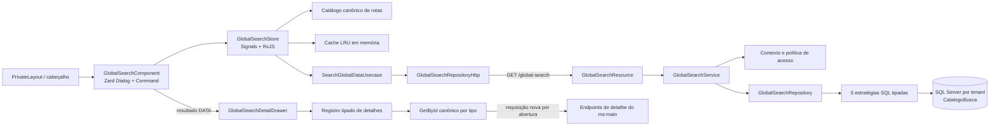

# Especificação técnica

## Resumo

A Pesquisa Global será implementada de ponta a ponta em dois projetos ativos: `ms-main`, responsável pela busca autenticada de dados persistidos e pelas políticas de leitura, e `municipalize-app`, responsável pelo catálogo local de navegação, cache efêmero, integração HTTP e experiência com Command e Drawer. `municipalize-admin-app`, `municipalize-chat-api` e `municipalize-mcp` não participam da solução.

No backend, um único `GET /global-search` consultará usuários, projetos, emendas, vereadores e instituições em uma operação própria. A consulta usará SQL Server Full-Text Search, filtros de autorização aplicados antes de ranking, contagens e paginação, e um contrato genérico sem entidades ou metadados abertos. A relevância será calculada exclusivamente no backend com faixas que garantem `exato > prefixo > full-text direto > parcial direto estritamente necessário > relacionamento`.

No frontend, um componente no cabeçalho do `private-layout` abrirá o Command oficial do Zard dentro do Dialog já instalado. O catálogo local responderá imediatamente; a fonte remota será consultada após 300 ms para termos normalizados com pelo menos três caracteres. Um cache LRU em memória, por aba, terá TTL de cinco minutos, máximo de 50 chaves, deduplicação de requisições em andamento e até cinco consultas recentes válidas. Resultados remotos abrirão o Drawer oficial do Zard sem mudar a URL e executarão um `GetById` novo em cada abertura.

Foram aprovadas as seguintes decisões de produto e rollout:

- projetos e emendas usarão a união de todas as visões canônicas que o usuário pode acessar, inclusive próprias, recebidas e arquivadas autorizadas;
- o Command exibirá somente a primeira página de até 20 resultados remotos e orientará a refinar o termo quando `hasMore` for verdadeiro;
- a ativação ficará bloqueada até a migration e sua verificação terem sido executadas em todos os bancos tenant; criar uma nova orquestração de migrations dentro do `ms-main` não faz parte deste escopo.

Premissas técnicas complementares:

- relações pesquisáveis ficam limitadas aos vínculos de primeiro nível definidos nesta especificação, sem expansão transitiva;
- o catálogo `CatalogoBusca` deverá operar com `ACCENT_SENSITIVITY = OFF`; eventual reconstrução ocorrerá na etapa operacional anterior à ativação;
- detalhes distinguem `403` para registro existente que deixou de ser autorizado e `404` para registro inexistente, sem incluir dados protegidos em nenhum erro.

## Arquitetura do sistema

### Visão dos componentes



| Componente | Responsabilidade | Estratégia |
|---|---|---|
| `GlobalSearchResource` | Validar entrada, exigir `admin`/`user`, delegar e mapear erros | Novo |
| `GlobalSearchService` | Resolver usuário local sem provisionamento, tipos autorizados, escopo e resposta | Novo |
| `GlobalSearchRepository` | Executar a consulta nativa agregada sem chamar resources/listagens | Novo |
| Estratégias em `impl/query` | Produzir candidatos diretos e relacionais por tipo com SQL e bindings fechados | Novo |
| Política de leitura | Manter busca e detalhes coerentes com as visões canônicas | Extrair/evoluir regras existentes |
| `CatalogoBusca` | Indexar texto em português e fornecer `RANK` via `CONTAINSTABLE` | Evoluir migrations 144/145 sem editá-las |
| Catálogo privado | Ser a fonte canônica de rótulo, rota, ícone, grupo e autorização local | Consolidar `PRIVATE_ROUTE_CONFIGS` e metadados de `privateRoutes` |
| `GlobalSearchStore` | Controlar estado, busca local, debounce, cancelamento e composição visual | Novo |
| `GlobalSearchCacheService` | TTL, LRU, contexto, recentes e requisições em andamento | Novo |
| `GlobalSearchDetailDrawer` | Carregar e exibir detalhe atual por tipo/ID sem cache de pesquisa | Novo, reutilizando GetById/conteúdos existentes |
| Zard Command/Dialog/Drawer | Acessibilidade, teclado, overlay e foco | Reutilizar Command/Dialog; adicionar Drawer pelo CLI |

#### Matriz canônica de visibilidade

A busca nunca concede acesso. A primeira etapa do backend cria um `GlobalSearchAccessContext` a partir do tenant já resolvido, do usuário local ativo, de seus papéis, função e vínculos ativos. Nenhum ID recebido no corpo ou query string será aceito como prova de tenant ou autorização.

| Tipo | Campos diretos | Universo autorizado | Relações de primeiro nível |
|---|---|---|---|
| `USER` | nome completo e e-mail | somente `ADMIN`, equivalente à listagem administrativa vigente | nenhuma |
| `PROJECT` | nome e campos textuais já indexados pela migration 144 | união de `GENERAL`, `MY_PROJECTS` e `RECEIVED`; inclui arquivados quando a visão canônica os inclui e rascunhos somente quando próprios/recebidos | emenda vinculada que corresponda diretamente |
| `AMENDMENT` | código SAPL e justificativa | união da listagem geral, próprias e arquivadas disponíveis ao papel/função atual | autor público, projeto e instituição vinculados |
| `COUNCILLOR` | nome completo do usuário, nome/sigla/número do partido | papéis `admin`/`user`, cadastro e usuário ativos, com mandato vigente; administrador conserva o acesso administrativo canônico ao detalhe | emenda de sua autoria/responsabilidade |
| `INSTITUTION` | nome, nome fantasia, e-mail e CNPJ | administrador: todas; demais: `hasAdministrator = true` ou criadas pelo usuário, preservando a listagem atual | projeto ou emenda vinculados |

Os campos físicos diretos serão fechados por estratégia: `usuario.nome_completo/email`; `projeto.nome_projeto`, descrições, impacto, abrangência, cronograma, beneficiários, observações, problemas e detalhes já presentes no índice 144; `emenda.codigo_sapl/justificativa`; `usuario.nome_completo` e `partido.nome/sigla/numero` para vereador; `instituicao.nome/nome_fantasia/email/cnpj`. `projeto.status_projeto` e `faixa_etaria_predominante`, embora atualmente indexados, serão apenas metadados/filtros e não identidade de match. IDs, CPF e contatos privados não entram em nenhuma estratégia.

As relações acima não formam cadeias. Por exemplo, um SAPL pode encontrar diretamente a emenda e, em faixas relacionais inferiores, seu projeto, instituição e vereador; ele não será propagado desses resultados para outras entidades. Resultados `USER` nunca serão produzidos por relacionamento.

Branches relacionais usarão apenas campos públicos já declarados: nome do autor, campos diretos do projeto/instituição e SAPL/justificativa da emenda. O e-mail de usuário poderá identificar somente o próprio resultado `USER` para administrador; nunca será usado para devolver emenda, projeto, instituição ou vereador por relação.

As mesmas regras deverão proteger o `GetById` usado pelo Drawer. Para evitar divergência futura, a implementação extrairá serviços de política de leitura por recurso e fixtures de contrato que executam a mesma matriz contra listagem canônica, busca e detalhe. Endpoints atuais que hoje validam apenas papel/tenant serão endurecidos para o universo de leitura já autorizado, com testes de regressão dos consumidores existentes.

## Design de implementação

### Principais interfaces

#### Backend

```java
public interface GlobalSearchRepository {
  GlobalSearchPage search(GlobalSearchCommand command, GlobalSearchAccessContext accessContext);
}

public interface GlobalSearchQueryStrategy {
  GlobalSearchType type();
  QueryFragment directCandidates(GlobalSearchCommand command, GlobalSearchAccessContext context);
  QueryFragment relationshipCandidates(GlobalSearchCommand command, GlobalSearchAccessContext context);
}
```

`QueryFragment` contém SQL controlado e bindings nomeados; nunca recebe trecho SQL do cliente. `GlobalSearchQueryAssembler` seleciona estratégias apenas a partir de `GlobalSearchType`, combina os CTEs com `UNION ALL`, deduplica por `(type, resource_id)`, calcula estatísticas no universo autorizado e pagina. O resultado nativo será lido por projeção `Tuple` tipada, não por `Object[]`, entidade ou `Map`.

`GlobalSearchService` seguirá esta ordem:

1. normalizar e validar o termo, a página, o limite e os tipos;
2. resolver tenant pela infraestrutura atual e usuário local ativo sem criar/sincronizar cadastro;
3. intersectar tipos solicitados com os tipos permitidos; um tipo não permitido não produz branch, resultado ou contagem;
4. construir o `GlobalSearchAccessContext` somente com dados confiáveis do backend;
5. executar o repository com timeout de banco de dois segundos;
6. mapear a página e remover qualquer campo fora do contrato seguro;
7. converter ausência/incompatibilidade de Full-Text Search em `503 GLOBAL_SEARCH_UNAVAILABLE`, sem fallback amplo.

O fluxo não provisionador hoje usado pelo contexto de Chat será extraído de `AuthService` para uma operação genérica de leitura do usuário local ativo. O consumidor atual será preservado e a Pesquisa Global não ficará acoplada ao módulo de Chat.

#### Frontend

```ts
export abstract class GlobalSearchRepository {
  abstract search(query: GlobalSearchQuery): Observable<GlobalSearchPage>;
}

export class SearchGlobalDataUsecase {
  execute(query: GlobalSearchQuery): Observable<GlobalSearchPage>;
}

export interface GlobalSearchDetailDefinition<T extends GlobalSearchDataType> {
  readonly type: T;
  readonly load: (id: number, abortSignal: AbortSignal) => Promise<GlobalSearchDetailByType[T]>;
  readonly icon: IconName;
  readonly label: string;
}
```

O `GlobalSearchStore` será fornecido no escopo do componente do cabeçalho e manterá Signals para abertura, termo, consulta normalizada, resultados locais, página remota, estado remoto, opção ativa e detalhe selecionado. `computed` será usado para resultados locais, grupos, mensagens e estado de apresentação.

Somente o pipeline assíncrono usará RxJS:

- `toObservable(term)`;
- normalização e `distinctUntilChanged()`;
- filtro de três caracteres;
- `debounceTime(300)`;
- consulta ao cache/in-flight;
- `switchMap()` para cancelar a requisição anterior;
- `takeUntilDestroyed()` para liberar recursos.

O `GlobalSearchCacheService` exporá `get`, `getOrLoad`, `listRecent` e `clearContext`. `getOrLoad` compartilhará o Observable em andamento com `shareReplay({ bufferSize: 1, refCount: true })`; `finalize` removerá o registro in-flight. Somente `next` concluído com sucesso, inclusive página vazia, criará cache. Cancelamento, `401`, `403`, timeout e demais erros não serão armazenados.

O Drawer manterá os parâmetros reativos `{ type, id, openRevision }`. `openRevision` será incrementado em toda abertura e troca, garantindo novo loader mesmo para o mesmo registro. O `resource` receberá `undefined` quando fechado, propagará seu `AbortSignal` ao adaptador do caso de uso e usará `reload()` apenas na tentativa novamente. O resumo e o cache da pesquisa não entram no registro de detalhes.

### Modelos de dados

#### Parâmetros de pesquisa

| Campo | Tipo | Regra |
|---|---|---|
| `term` | `string` | obrigatório; trim, espaços colapsados, 3 a 120 caracteres normalizados |
| `types` | `GlobalSearchType[]` | opcional e repetível; sem valor significa todos os tipos autorizados |
| `page` | `int` | opcional, 0-based, padrão `0`, mínimo `0` |
| `limit` | `int` | opcional, padrão `20`, entre `1` e `20` |

O tenant não será query param. `X-Tenant-ID` e `X-Frontend-Url` continuam sendo transportados pelos interceptors existentes e resolvidos pelo backend; o JWT e o usuário local ativo são as provas de autenticação/autorização.

#### Tipos controlados

| Tipo | Valores |
|---|---|
| `GlobalSearchType` | `USER`, `PROJECT`, `AMENDMENT`, `COUNCILLOR`, `INSTITUTION` |
| `GlobalSearchOrigin` | backend: `DATA`; modelo visual frontend: `DATA`, `NAVIGATION` |
| `GlobalSearchMatchKind` | `DIRECT`, `RELATIONSHIP` |
| `GlobalSearchField` | `FULL_NAME`, `EMAIL`, `PROJECT_NAME`, `PROJECT_DESCRIPTION`, `SAPL_CODE`, `JUSTIFICATION`, `PARTY_NAME`, `PARTY_ACRONYM`, `PARTY_NUMBER`, `INSTITUTION_NAME`, `TRADE_NAME`, `CNPJ` |
| `GlobalSearchRelationship` | `AUTHOR`, `PROJECT`, `AMENDMENT`, `INSTITUTION` |
| `GlobalSearchIcon` | valores semânticos iguais aos tipos; o frontend os converte para `IconName` |

Enums desconhecidos na entrada retornam `400 INVALID_SEARCH_TYPE`. A adição futura de um tipo exige enum, estratégia, metadado discriminado, detalhe e testes, mas não altera o endpoint.

#### Resposta agregada

```json
{
  "normalizedTerm": "42/2026",
  "results": [
    {
      "resourceId": 731,
      "origin": "DATA",
      "type": "AMENDMENT",
      "group": "Emendas",
      "title": "Emenda — código SAPL 42/2026",
      "secondaryText": "Saúde básica",
      "description": null,
      "icon": "AMENDMENT",
      "score": 509000,
      "match": {
        "kind": "DIRECT",
        "field": "SAPL_CODE",
        "relationship": null,
        "displayText": "Correspondência no código SAPL"
      },
      "metadata": {
        "kind": "AMENDMENT",
        "saplCode": "42/2026",
        "status": "APPROVED_IN_PLENARY",
        "amendmentType": "INDIVIDUAL"
      }
    }
  ],
  "total": 24,
  "countsByType": [
    { "type": "AMENDMENT", "count": 8 },
    { "type": "PROJECT", "count": 10 },
    { "type": "INSTITUTION", "count": 6 }
  ],
  "page": 0,
  "pageSize": 20,
  "totalPages": 2,
  "hasMore": true
}
```

`countsByType` contém apenas tipos solicitados e autorizados, ordenados pelo enum. Seu somatório é igual a `total`. Um não administrador não recebe elemento `USER`, mesmo quando o solicita isoladamente. Uma página vazia ainda retorna contagens e paginação coerentes.

`group` e `displayText` são rótulos controlados do backend, não rotas ou nomes de componentes. O backend fornece um ícone semântico; o registro frontend decide o ícone Lucide. `resourceId` nunca será exibido como código de negócio nem participará do match.

#### Metadados discriminados

`metadata.kind` discrimina uma união fechada em Java e TypeScript:

| `kind` | Campos permitidos |
|---|---|
| `USER` | `status`, `function`; e-mail fica em `secondaryText` somente para administrador |
| `PROJECT` | `status`, `institutionName` |
| `AMENDMENT` | `saplCode`, `status`, `amendmentType` |
| `COUNCILLOR` | `partyName`, `partyAcronym`, `partyNumber`, `termEndDate` |
| `INSTITUTION` | `tradeName`, `cnpj`, `email`, respeitando a visibilidade atual |

Campos nulos são omitidos. CPF, telefone, endereço completo, documentos, senha/token, Keycloak ID, conteúdo completo e coleções relacionadas são proibidos nesse DTO. `match.displayText` terá no máximo 160 caracteres e será construído apenas de campo já autorizado. Trechos textuais serão escapados no frontend e nunca renderizados como HTML recebido.

#### Ranking e deduplicação

| Faixa | Base | Complemento máximo |
|---|---:|---:|
| Exato direto | 500.000 | 9.999 |
| Prefixo direto | 400.000 | 9.999 |
| Full-text direto | 300.000 | `RANK` de 0 a 1.000 + peso de campo |
| Parcial direto necessário | 200.000 | 9.999 |
| Somente relacionamento | 100.000 | 9.999 |

Código SAPL exato recebe o maior peso de campo da faixa exata. A branch parcial não será um `LIKE '%term%'` genérico: ficará restrita a SAPL/CNPJ normalizados quando exact, prefixo e FTS não forem capazes de preservar formatação, e deverá ser sustentada por plano de execução e teste p95. Texto livre usa `CONTAINSTABLE`, nunca essa branch.

Cada estratégia pode produzir mais de um candidato para o mesmo recurso. `ROW_NUMBER() OVER (PARTITION BY type, resource_id ORDER BY score DESC, match_priority ASC)` conserva apenas a melhor justificativa. A ordenação final é `score DESC`, prioridade estável do tipo, título normalizado e `resourceId`, garantindo paginação determinística. Itens relacionais, mesmo com ótimo match na entidade de origem, permanecem abaixo de qualquer match direto.

Uma única instrução SQL usará CTEs de candidatos, deduplicação, estatísticas e página. `stats LEFT JOIN page` preservará `total` e contagens mesmo quando não houver itens. Os cinco counts serão colunas internas fixas, convertidas no serviço para a lista tipada; nenhum segundo count divergente será executado.

#### Normalização

Haverá duas rotinas explícitas:

- texto: Unicode, trim, colapso de espaços, igualdade/prefixo com collation `Latin1_General_100_CI_AI`, caixa/acento no FTS tratados pelo catálogo `ACCENT_SENSITIVITY = OFF`, tokens preservados e expressão FTS segura no formato `"token1*" AND "token2*"`;
- códigos: remoção apenas de separadores de formatação conhecidos, preservando letras e dígitos e sem converter ID interno em termo pesquisável.

Aspas e operadores FTS do usuário serão tratados como texto. O assembler escapará cada token e enviará a expressão como parâmetro. A função `fn_normalize_search` atual poderá continuar nos fluxos existentes, mas não será reutilizada para tokenização FTS porque remove limites entre palavras.

#### Modelos do frontend

`GlobalSearchPresentationItem` será uma união imutável:

- `NavigationSearchItem`: `origin: NAVIGATION`, `catalogId`, `route`, rótulo, descrição, grupo, ícone e termos de intenção;
- `DataSearchItem`: `origin: DATA`, o resumo da API e apenas `{ type, resourceId }` como destino.

`GlobalSearchViewState` será uma união discriminada para `RECENT`, `GUIDANCE`, `BELOW_MINIMUM`, `LOADING`, `RESULTS`, `EMPTY` e `REMOTE_ERROR`. `REMOTE_ERROR` pode coexistir com resultados locais; `EMPTY` só ocorre quando ambas as fontes concluíram sem item. A apresentação de match usará texto e marcação semântica `<mark>` construída de segmentos escapados, acompanhada da justificativa direta/relacional, sem depender apenas de cor.

`GlobalSearchCacheEntry` conterá `key`, `query`, `response`, `receivedAt` e `lastUsedAt`. A chave será uma serialização canônica de termo normalizado, tipos ordenados, página, limite e `AuthorizationFingerprint` (`userId`, tenant, papéis ordenados, função e IDs ordenados dos vínculos ativos conhecidos pelo contexto). O TTL será contado a partir de `receivedAt`; leitura atualiza somente `lastUsedAt` para LRU/recentes.

O catálogo local evoluirá o `PrivateRouteConfig` existente com `id`, `description`, `keywords`, `synonyms`, `intents` e `searchable`. `PRIVATE_ROUTE_CONFIGS` permanecerá a exportação compatível e será a fonte canônica para menu, pesquisa e política local. `privateRoutes` continuará descrevendo loaders/estrutura, mas seus metadados duplicados de papel, função, ícone e grupo serão derivados por helper que recebe o `catalogId`. Testes de consistência falharão se um item pesquisável não resolver uma rota real ou se uma rota catalogada duplicar ID/caminho.

#### Envelope de erro

O backend preservará o `ErrorResponse` vigente:

```json
{
  "error": "GLOBAL_SEARCH_UNAVAILABLE",
  "message": "A pesquisa está temporariamente indisponível."
}
```

Mensagens não incluirão SQL, termo digitado, IDs de outro tenant ou causa interna. O repository manterá a causa apenas no log estruturado.

### Endpoints da API (se aplicável)

#### Visão geral

| Método e rota | Autorização | Finalidade |
|---|---|---|
| `GET /global-search` | `@RolesAllowed({"admin", "user"})` | Buscar os cinco tipos em uma única operação |
| `GET /user/users/{id}` | `admin` | Novo detalhe canônico seguro de usuário |
| `GET /projects/{id}/details` | `admin`, `user` + política por registro | Detalhe existente de projeto |
| `GET /amendment/{id}/details` | `admin`, `user` + política por registro | Detalhe existente de emenda |
| `GET /councillor/{id}` | `admin`, `user` + política vigente | Detalhe existente de vereador |
| `GET /institutions/{id}` | autenticado + política por registro | Detalhe existente de instituição |

Os endpoints de detalhe não compõem a pesquisa. Eles só são chamados depois da seleção e preservam seus contratos, salvo os erros de autorização/not-found que serão normalizados e o novo endpoint administrativo de usuário.

#### `GET /global-search`

Exemplo:

```http
GET /global-search?term=saude%20basica&types=PROJECT&types=AMENDMENT&page=0&limit=20
Authorization: Bearer <token>
X-Tenant-ID: <tenant-resolvido>
X-Frontend-Url: <origem-validada>
```

Comportamento:

- é idempotente e não cria/sincroniza usuário;
- responde `200` com página vazia quando não há correspondências autorizadas;
- omite tipos não autorizados em vez de executar a branch ou retornar seu count;
- nunca retorna mais de 20 itens e rejeita limites fora de `1..20`;
- não aceita sort arbitrário: ranking e desempate são fixos;
- aplica timeout de query de dois segundos e o cliente usará timeout de cinco segundos;
- não possui retry automático; a repetição ocorre somente pela ação “Tentar novamente”.

| Status | Código | Situação |
|---:|---|---|
| `400` | `INVALID_SEARCH_TERM` | termo ausente, menor que 3 ou maior que 120 após normalização |
| `400` | `INVALID_PAGINATION` | página negativa ou limite fora de 1–20 |
| `400` | `INVALID_SEARCH_TYPE` | enum desconhecido |
| `401` | padrão OIDC | token ausente/inválido ou usuário local não resolvido |
| `503` | `GLOBAL_SEARCH_UNAVAILABLE` | Full-Text Search ausente, índice incompatível, catálogo em falha ou timeout |
| `500` | `GLOBAL_SEARCH_ERROR` | erro inesperado, com mensagem pública genérica |

#### Endpoints de detalhe

O novo `GET /user/users/{id}` reutilizará `UserResponse`, que não contém senha nem Keycloak ID, e retornará `403` para não administrador e `404` quando o usuário não existir no tenant atual.

Os demais serviços executarão `ensureCanRead` antes de materializar o DTO completo. Se o registro existir no datasource atual, mas o usuário não estiver mais no universo permitido, retornarão `403` com envelope seguro; se não existir, `404`. Nenhum endpoint tentará localizar o ID em outro datasource para diferenciar os estados.

## Pontos de integração

#### SQL Server e Flyway

A implementação criará uma migration incremental com a próxima versão livre no momento da task, sem editar `V1.0.144__create_fulltext_projeto.sql` nem `V1.0.145__create_fulltext_usuario_instituicao.sql`. Ela deverá:

1. falhar com `THROW` se `FULLTEXTSERVICEPROPERTY('IsFullTextInstalled') <> 1`;
2. criar `CatalogoBusca` se necessário e reconstruí-lo com `ACCENT_SENSITIVITY = OFF` somente quando a propriedade atual for diferente;
3. validar ou criar índices unique-key de uma única coluna para `usuario`, `projeto`, `emenda`, `partido` e `instituicao`;
4. preservar os índices existentes e acrescentar, via migration nova, as colunas faltantes quando compatível;
5. criar full-text de `emenda` para `justificativa` e `codigo_sapl`, idioma 1046, `CHANGE_TRACKING = AUTO`, `STOPLIST = OFF`;
6. criar full-text de `partido` para `nome` e `sigla`; `numero` continua com comparação direta sobre o índice convencional existente;
7. manter usuário (`nome_completo`, `email`), projeto (campos atuais) e instituição (`nome`, `nome_fantasia`, `email`) no catálogo;
8. pesquisar CNPJ normalizado pelo valor de 14 dígitos e seu índice convencional; código SAPL terá normalização/indexação auxiliar apenas se o plano real exigir;
9. validar `sys.fulltext_indexes`, colunas, idioma, change tracking, stoplist, `FULLTEXTCATALOGPROPERTY` e conclusão da população.

O `Dockerfile.mssql` existente já instala `mssql-server-fts` e será reutilizado para integração. A pipeline operacional deverá enumerar o registry real de tenants, aplicar a mesma migration em cada banco e executar o script de verificação. O `migrate-at-start` do datasource `default` não será considerado evidência para tenants programáticos. A entrega do frontend só será habilitada após 100% dos tenants ativos passarem nessa verificação.

#### Autenticação e tenant

`TenantResolver` e `TenantConnectionResolver` continuam selecionando o datasource. `GlobalSearchResource` não terá fallback de tenant próprio. A resolução não provisionadora de usuário validará subject/e-mail do token contra um usuário local ativo no datasource selecionado; inconsistência encerra a requisição antes de qualquer busca.

Os predicados de vínculo usam IDs resolvidos no backend: usuário atual, vereador ativo correspondente, assessor ativo e vereadores com vínculo ativo, além dos papéis/função. O contexto de vereador selecionado somente no navegador não amplia autorização.

#### Catálogo de navegação e guards

`PRIVATE_ROUTE_CONFIGS`, `ListRoutesMenuUsecase` e `CheckPermissionsRouteUsecase` serão consolidados em torno do mesmo tipo canônico. O helper de `privateRoutes` elimina duplicação de `roles`, `functions`, `icon` e `group`; breadcrumbs e loaders permanecem estruturais. Durante a migração, a exportação atual é preservada para consumidores existentes.

O caso de uso local normaliza caixa/acento e pontua nome, descrição, módulo, palavras-chave, sinônimos e intenções. As intenções iniciais incluem cadastrar, criar, consultar, listar, editar, revisar, acompanhar e configurar somente quando a rota correspondente existe. A política local filtra antes da pontuação; o `role.guard` continua obrigatório no acesso direto.

#### Zard UI e Angular

O Command e o Dialog existentes serão compostos sem overlay manual. O Drawer será adicionado em `municipalize-app` pelo fluxo suportado no projeto, `npx zard-cli add drawer`, após confirmar que o diretório ainda não existe e sem sobrescrever customizações. Ícones usarão `@ng-icons/lucide` e estilos usarão apenas Tailwind/tokens semânticos atuais.

O Command receberá `zCommand` com título, contexto e justificativa segura. Isso impede que o filtro interno do componente esconda um resultado relacional já devolvido pelo store. Um live region externo em português anunciará mínimo de caracteres, carregamento, quantidade, vazio e erro sem depender de cor. O Dialog fará focus trap e fechamento por Esc; o Drawer devolverá foco ao acionador do cabeçalho quando fechar.

O listener global abrirá a pesquisa somente para `Ctrl+K` ou `Meta+K`, sem `Alt`/`Shift`, quando o evento não tiver sido tratado e o alvo não estiver em `input`, `textarea`, `select` ou `[contenteditable]`. `preventDefault()` só ocorrerá quando o Command for realmente aberto. Após a abertura do Dialog, o `ZardCommandInputComponent.focus()` será chamado. Ao selecionar um dado, o store guardará o acionador, fechará o Dialog, limpará o estado transitório e abrirá o Drawer no callback de fechamento, evitando dois focus traps simultâneos.

O botão “Ações” será visível no cabeçalho do detalhe com `aria-disabled="true"`, estilo semanticamente desabilitado e handler que não abre menu nem executa navegação, comando ou mutação. Ele permanecerá focável para anunciar “Ainda não há ações disponíveis nesta versão”. O corpo do Drawer mapeará separadamente loading, sucesso, `403`, `404` e erro recuperável; somente este último apresentará “Tentar novamente”.

O `resource` do Angular é apropriado apenas para leitura e cancela loaders por `AbortSignal`; os adaptadores converterão os casos de uso Promise/Observable existentes sem mover HTTP para o componente. Projeto e emenda terão o conteúdo visual extraído de seus containers atuais para componentes de apresentação reutilizáveis. Usuário, vereador e instituição ganharão apenas as apresentações read-only ausentes.

#### Limites visuais

- grupo local “Telas e funcionalidades”: máximo de oito itens, ordenados por score local determinístico;
- grupos remotos: todos os itens recebidos na página, sem reordenar nem recalcular score; como a página inteira tem no máximo 20, nenhum grupo excede esse valor;
- ordem dos grupos: Telas e funcionalidades, Usuários, Projetos, Emendas, Vereadores e Instituições;
- a ordem relativa recebida do backend é preservada dentro de cada grupo;
- `hasMore = true` exibe “Há mais resultados; refine sua busca”, sem paginação incremental nesta versão.

#### Cache e ciclo de vida

O cache vive apenas na instância JavaScript da aba. Não haverá `localStorage`, `sessionStorage`, IndexedDB, Service Worker nem cache HTTP persistente. O `AdvisorCouncillorContextStore` pode continuar persistindo sua seleção para o recurso existente, mas a Pesquisa Global não persistirá suas entradas.

Um `effect` limitado à sincronização imperativa do fingerprint de autorização chamará `clearContext` quando usuário, tenant, papéis, função ou conjunto de vínculos mudar. Logout e destruição do layout cancelam in-flight. Expiração é verificada antes de toda leitura e listagem de recentes. Ao atingir a 51ª chave, a menos recentemente usada é removida. Reabrir o Command limpa termo/seleção/estado transitório, mas mantém até cinco recentes cujo cache ainda seja válido.

Sem termo, `listRecent` devolve no máximo cinco consultas distintas por `lastUsedAt` decrescente; se não houver entrada, o estado é `GUIDANCE` e nenhuma carga ampla é iniciada. Selecionar uma recente revalida TTL/fingerprint, restaura termo e página diretamente da entrada e atualiza seu MRU sem HTTP. Se ela expirar entre renderização e seleção, será removida e seguirá o fluxo normal com debounce.

## Abordagem de testes

### Testes de unidade

#### `ms-main`

- `GlobalSearchTermNormalizerTest`: espaços, acentos, caixa, aspas, operadores, múltiplos termos, SAPL/CNPJ e limites;
- `GlobalSearchAuthorizationServiceTest`: tipos por papel/função e escopos de vereador/assessor;
- testes por estratégia: bindings, campos permitidos, relações de primeiro nível e ausência de ID interno;
- `GlobalSearchServiceTest`: interseção de tipos, página, counts, vazio, timeout e envelopes;
- `GlobalSearchMapperTest`: união discriminada e bloqueio de campos sensíveis;
- políticas de leitura: busca e detalhe aprovam/rejeitam os mesmos fixtures.

O `pom.xml` passará a configurar JaCoCo no `verify`, com mínimo de 80% para linhas e branches. DTOs não serão usados como justificativa para excluir lógica. Caso o baseline atual não atinja o gate, a remediação será uma dependência explícita da task e o limite não será desabilitado.

#### `municipalize-app`

- catálogo: normalização, sinônimos/intenção, score, limites, IDs únicos, rotas reais e autorização;
- cache: TTL exato desde `receivedAt`, LRU 50, MRU cinco, cache vazio, fingerprint, clear, erro e cancelamento;
- in-flight: duas consultas idênticas compartilham uma chamada e liberam o registro ao concluir/errar/cancelar;
- store com timers do Vitest: resposta local imediata, 299/300 ms, mínimo de três caracteres, `switchMap`, retry e falha remota sem perder local;
- repository HTTP com `HttpTestingController`: query params, headers via interceptor, mapeamento e cancelamento;
- registro de detalhe: exhaustividade dos cinco tipos, `openRevision`, `reload`, 403/404/erro e ausência de cache;
- componentes read-only e extrações de projeto/emenda.

`angular.json` receberá `coverageThresholds` de 80 para statements, branches, functions e lines, usando o builder Vitest já configurado.

### Testes de integração

#### Backend e persistência real

Uma suíte dedicada usará o SQL Server 2022 construído pelo `Dockerfile.mssql`, com Full-Text Search real. Ela criará dois bancos tenant independentes, aplicará migrations e carregará fixtures representativas dos cinco tipos.

Cobertura obrigatória:

- migration partindo do estado anterior, execução repetida segura onde aplicável e dados preservados;
- catálogo accent-insensitive, idioma 1046, `AUTO`, `STOPLIST OFF`, unique keys e população concluída;
- prefixo AND de múltiplos termos, caixa, acento, SAPL e CNPJ formatados;
- ranking entre exato, prefixo, `CONTAINSTABLE.RANK`, parcial restrito e relacionamento;
- deduplicação, desempates, mistura de tipos, filtro, paginação, página vazia e counts coerentes;
- usuários somente admin, matriz de projeto/emenda/instituição/vereador e regressão dos `GetById`;
- resposta de tenant A sem qualquer item/count/trecho de tenant B;
- FTS ausente/incompatível identificável, sem fallback;
- plano de execução e p95 menor ou igual a 500 ms com volume representativo acordado para cada tenant de referência.

Testes REST com `@QuarkusTest` validarão contrato, autenticação, validação e códigos públicos. Mocks poderão isolar o resource/service, mas não substituirão a suíte SQL Server para ranking, migrations ou isolamento.

#### Frontend integrado

TestBed usará os componentes Zard reais para Command/Dialog/Drawer e mocks somente nos limites HTTP. Os testes validarão clique e `Ctrl/Cmd+K`, exceção em campo editável, setas/Enter/Esc, grupos, falha parcial, limpeza ao fechar, URL imutável para dados, navegação para item local e uma nova chamada de detalhe a cada abertura.

### Testes E2E

O QA executará no navegador disponível, sem criar por premissa um projeto Playwright central. Cenários desktop e mobile:

- abrir pelo cabeçalho e pelos atalhos em Windows/Linux e macOS;
- buscar com um/dois/três caracteres, digitação rápida e termo relacional;
- selecionar por mouse, toque e teclado;
- navegar para rota local autorizada e confirmar guard em rota proibida;
- abrir cada um dos cinco detalhes sem alterar URL;
- fechar/reabrir o mesmo detalhe e inspecionar nova requisição;
- provocar 403, 404, 503 e erro recuperável;
- comprovar cache em cinco minutos, invalidação por contexto, limite 50 e recentes;
- testar foco entre acionador, Dialog, Command e Drawer;
- executar auditoria automatizada WCAG 2.1 AA sem violações críticas/sérias da feature;
- verificar rolagem, truncamento e controles em viewports suportados.

#### Rastreabilidade dos critérios

| Critérios | Evidência principal |
|---|---|
| CA-01–CA-12 | testes de componente/store e E2E de Command, estados, teclado, mobile e acessibilidade |
| CA-13–CA-15 | contrato REST, inspeção de tráfego e teste de que apenas `GlobalSearchRepository` compõe dados |
| CA-16–CA-18 | fixtures SQL Server de SAPL, relações e faixas de ranking entre tipos |
| CA-19–CA-22 | matriz de autorização, dois tenants e snapshots do DTO seguro |
| CA-23–CA-24 | registro tipado e fixtures dos cinco tipos/campos reais |
| CA-25–CA-27 | migration, FTS real, falhas detectáveis e suíte backend completa |
| CA-28–CA-30 | suíte frontend completa, cobertura 80%, lint, testes, verify e builds |
| CA-31–CA-36 | E2E do Drawer, URL, novo GetById, cinco detalhes, estados e botão Ações |
| CA-37–CA-41 | testes com relógio/controlador HTTP e E2E de cache, contexto, LRU e recentes |

## Sequenciamento do desenvolvimento

### Ordem de construção

1. Consolidar a matriz de leitura e criar testes de caracterização das listagens/GetById atuais.
2. Consolidar `PRIVATE_ROUTE_CONFIGS` como catálogo canônico e adicionar o teste de consistência de rotas.
3. Criar os contratos genéricos backend/frontend e os enums discriminados, sem UI.
4. Criar a migration Full-Text e sua suíte SQL Server; executar a validação nos bancos de desenvolvimento.
5. Implementar contexto autenticado não provisionador, estratégias, assembler, repository, service e `GET /global-search`.
6. Endurecer/reutilizar os detalhes existentes e adicionar o detalhe administrativo de usuário.
7. Implementar repository/usecase frontend, cache, store e busca local; integrar Command/Dialog no cabeçalho.
8. Adicionar Drawer via Zard CLI, registro tipado e componentes de apresentação dos cinco tipos.
9. Completar integração, cobertura, acessibilidade, responsividade e benchmark; corrigir regressões.
10. Aplicar/verificar a migration em todos os tenants, implantar backend e só então disponibilizar o frontend.

Cada etapa deve terminar com seus testes focados. A task de UI remota não começa antes de o contrato e a matriz de autorização estarem estáveis; o rollout não começa antes dos testes SQL reais e da verificação tenant a tenant.

### Dependências técnicas

- SQL Server 2022 com o pacote Full-Text Search instalado;
- acesso operacional ao registry real de bancos tenant e ao mecanismo que executa Flyway em cada banco;
- `CatalogoBusca` disponível para reconstrução controlada quando accent-sensitive;
- Angular 22, Vitest, `@vitest/coverage-v8`, Signals e `resource` já presentes;
- Zard Command e Dialog atuais; `zard-cli` disponível para adicionar Drawer;
- interceptors atuais de autenticação/tenant;
- GetById existentes de projeto, emenda, vereador e instituição;
- componentes/seções atuais de projeto e emenda que serão extraídos sem duplicar regra;
- dados representativos e janela operacional para popular/reconstruir índices.

Bloqueios de rollout:

- algum tenant ativo sem migration/índice/população válida;
- p95 acima de 500 ms no volume representativo sem plano de correção;
- regressão de autorização/listagem/detalhe;
- cobertura ou gates de qualquer um dos dois projetos abaixo do exigido.

## Monitoramento e observabilidade

O backend emitirá logs estruturados sem o termo pesquisado e sem PII:

- `global_search.completed`: request/correlation ID, tenant técnico, tipos autorizados, página, limite, quantidade, duração total e duração SQL;
- `global_search.empty`: mesmos campos sem conteúdo da consulta;
- `global_search.rejected`: código de validação/autenticação, sem parâmetros sensíveis;
- `global_search.unavailable`: categoria `FTS_MISSING`, `INDEX_INVALID`, `POPULATION_FAILED` ou `TIMEOUT` e causa interna sanitizada;
- `global_search.detail_denied/not_found`: tipo e ID apenas no log protegido, nunca no corpo cruzado entre tenants.

O termo, e-mail, CNPJ, SAPL, nome, match excerpt e fingerprint de autorização não serão gravados. A infraestrutura de logs existente será usada para derivar volume, taxa de erro e p50/p95; não será introduzido analytics de pesquisa, pois está fora do escopo.

Indicadores e alertas operacionais:

- p95 backend acima de 500 ms por 15 minutos;
- `503` acima de 1% das consultas em cinco minutos;
- timeout SQL ou falha FTS em qualquer tenant;
- drift de migration/índice detectado na verificação pré-deploy;
- crescimento anormal de resposta, sempre limitado a 20 itens.

O script pré-deploy produzirá evidência por tenant: versão Flyway, `IsFullTextInstalled`, accent sensitivity, índices/colunas, `PopulateStatus = 0` e consulta canário. Não será adicionado um health check genérico que valide apenas o datasource `default`, pois ele criaria falsa segurança para os datasources programáticos. Em runtime, o endpoint faz fail closed com `503`; não executa `LIKE` amplo.

No frontend, falhas continuam visíveis e recuperáveis no Command/Drawer, mas consultas não serão persistidas ou enviadas a analytics. O cache poderá expor contadores apenas em testes/desenvolvimento (`hit`, `miss`, `expired`, `deduplicated`), sem logar chave ou conteúdo.

## Considerações técnicas

### Principais decisões

| Decisão | Motivo e consequência |
|---|---|
| Um endpoint global, um repository próprio | Evita N chamadas e impede composição por resources/listagens |
| União das visões canônicas para projeto/emenda | Decisão aprovada; não perde rascunhos próprios, recebidos ou arquivados autorizados |
| Primeira página apenas no Command | Decisão aprovada; mantém a experiência enxuta e usa `hasMore` para orientar refinamento |
| Migration por tenant como gate externo | Decisão aprovada; não amplia a feature para uma nova plataforma de orquestração |
| `CONTAINSTABLE` com faixas fixas | Usa o `RANK` do banco sem permitir que relação supere match direto |
| Um statement com stats e página | Mantém counts/paginação coerentes, inclusive em página vazia |
| `ACCENT_SENSITIVITY = OFF` | Fecha RF27/RF30 de forma determinística; reconstrução ocorre antes da ativação |
| Relações somente de primeiro nível | Controla custo, explicabilidade e vazamento; novas relações exigem estratégia/teste explícitos |
| `PRIVATE_ROUTE_CONFIGS` como catálogo canônico | Reutiliza menu/guard existentes e remove metadados duplicados de `privateRoutes` sem criar terceira lista |
| Cache LRU no frontend | Atende repetição imediata sem misturar tenants/usuários nem introduzir cache servidor |
| `openRevision` no `resource` | Garante novo GetById para reabertura do mesmo item |
| `403` distinto de `404` no detalhe | Sustenta os estados explícitos do Drawer; ambos permanecem sem conteúdo protegido |
| Sem fallback full-text | Falha fechada e observável é mais segura que scan amplo e ranking inconsistente |

As decisões de SQL seguem o comportamento documentado de `CONTAINSTABLE`, cujo resultado inclui `RANK`, e de `ALTER FULLTEXT CATALOG ... REBUILD WITH ACCENT_SENSITIVITY = OFF`. O uso de `resource` segue a API estável do Angular 22 para leitura reativa e cancelamento por `AbortSignal`. A configuração multi-tenant respeita a distinção do Quarkus entre datasources definidos no build e conexões resolvidas programaticamente.

Referências primárias:

- [CONTAINSTABLE — SQL Server](https://learn.microsoft.com/en-us/sql/relational-databases/system-functions/containstable-transact-sql)
- [ALTER FULLTEXT CATALOG — SQL Server](https://learn.microsoft.com/en-us/sql/t-sql/statements/alter-fulltext-catalog-transact-sql)
- [Angular `resource`](https://angular.dev/api/core/resource)
- [Angular code coverage](https://angular.dev/guide/testing/code-coverage)
- [Quarkus Hibernate ORM multitenancy](https://quarkus.io/guides/hibernate-orm/)
- [Quarkus Flyway](https://quarkus.io/guides/flyway)

### Riscos conhecidos

| Risco | Mitigação |
|---|---|
| Migration aplicada somente ao datasource default | inventário de tenants, execução/verificação por banco e gate de 100% antes do frontend |
| Rebuild accent-insensitive causar repopulação/degradação | janela operacional, medição de duração, `PopulateStatus = 0` e consulta canário |
| `RANK` variar entre corpora/tabelas | faixas invariantes, pesos pequenos, fixtures reais entre tipos e desempate determinístico |
| Relações ampliarem demais o universo | matriz fechada de primeiro nível, sem transitividade e benchmark por estratégia |
| Política de detalhe hoje mais permissiva | testes de caracterização, extração gradual de `ensureCanRead` e regressão de consumidores |
| Drift entre rota, menu e pesquisa | fonte canônica, helper de metadados e teste estrutural obrigatório |
| Cache vazar contexto | fingerprint completo, clear em mudança, TTL, LRU e nenhum armazenamento persistente |
| Cancelamento não interromper HTTP compartilhado | `switchMap`, `refCount: true`, propagação de abort e testes com `HttpTestingController` |
| Drawer reutilizar detalhe antigo | `openRevision`, `resource` idle ao fechar e teste de tráfego a cada reabertura |
| Componentes de detalhe excederem limites | extrair conteúdos pequenos, read-only e co-localizados em vez de crescer containers legados |
| p95 falhar com dados representativos | planos de execução, índices focados, limites por branch e bloqueio de rollout |
| JaCoCo revelar dívida de cobertura existente | tratar como dependência explícita; não reduzir/desativar o gate de 80% |

### Conformidade com o AGENTS.md e as rules

- O artefato permanece em `tasks/prd-pesquisa-global/` na raiz porque atravessa dois repositórios.
- Somente `municipalize-app` e `ms-main` serão alterados; projetos legados e Admin API ficam fora.
- Cada repositório será validado a partir de sua própria raiz e preservará alterações não relacionadas.
- Tenant, autenticação, autorização por tipo/registro e contrato seguro são aplicados no backend antes de counts/ranking.
- Migrations serão incrementais, nunca editarão arquivos aplicados e serão testadas em SQL Server real.
- Java novo seguirá Java 17, Quarkus/Jakarta, injeção por construtor, contratos imutáveis, classes de até 100 linhas e métodos de até 30 linhas; estratégias separadas evitam uma classe agregadora extensa.
- Angular novo seguirá standalone, tipagem estrita, Signals/`computed`, `OnPush`, HTTP em repository, caso de uso na camada `aplication` e componentes TS de até 100 linhas/template de até 120 linhas.
- UI usará componentes Zard, ícones Lucide, Tailwind v4 e tokens semânticos; não haverá HTML/CSS/overlay manual equivalente ao Drawer.
- Erros serão específicos, sanitizados e recuperáveis; não haverá `catch` silencioso nem fallback inseguro.
- Cobertura mínima de 80%, lint, testes, builds, `mvn verify` e packages são gates obrigatórios.
- Documentação pública de interfaces/enums explicará invariantes, autorização, cache, ranking e extensão futura; detalhes óbvios não receberão comentários redundantes.

### Conformidade com skills

| Skill | Aplicação na implementação |
|---|---|
| `angular-developer` | standalone/OnPush, Signals para estado síncrono, `computed` para derivados, RxJS restrito ao fluxo assíncrono, `resource` para detalhe, Router/guards, TestBed/Vitest e acessibilidade Angular |
| `zard` | composição do Command/Dialog existentes, instalação do Drawer pelo CLI suportado, componentes source-installed, tokens do tema, ícones Lucide e ausência de reimplementação manual |

### Arquivos relevantes e dependentes

#### Artefatos na raiz

- `tasks/prd-pesquisa-global/prd.md` — fonte funcional.
- `tasks/prd-pesquisa-global/techspec.md` — esta especificação.

#### `ms-main` — novos

- `src/main/java/br/com/municipalize/rest/GlobalSearchResource.java`
- `src/main/java/br/com/municipalize/rest/request/GlobalSearchRequest.java`
- `src/main/java/br/com/municipalize/rest/response/GlobalSearchResponse.java`
- `src/main/java/br/com/municipalize/rest/response/GlobalSearchResultResponse.java`
- `src/main/java/br/com/municipalize/rest/response/GlobalSearchTypeCountResponse.java`
- `src/main/java/br/com/municipalize/rest/response/GlobalSearchMetadataResponse.java`, `GlobalSearchMatchResponse.java` e records discriminados `UserSearchMetadataResponse`, `ProjectSearchMetadataResponse`, `AmendmentSearchMetadataResponse`, `CouncillorSearchMetadataResponse` e `InstitutionSearchMetadataResponse`
- `src/main/java/br/com/municipalize/model/enums/GlobalSearchType.java`, `GlobalSearchOrigin.java`, `GlobalSearchMatchKind.java`, `GlobalSearchField.java`, `GlobalSearchRelationship.java` e `GlobalSearchIcon.java`
- `src/main/java/br/com/municipalize/command/GlobalSearchCommand.java`
- `src/main/java/br/com/municipalize/service/GlobalSearchService.java`
- `src/main/java/br/com/municipalize/service/GlobalSearchAuthorizationService.java`
- `src/main/java/br/com/municipalize/service/UserReadAccessService.java`, `ProjectReadAccessService.java`, `AmendmentReadAccessService.java`, `CouncillorReadAccessService.java` e `InstitutionReadAccessService.java`
- `src/main/java/br/com/municipalize/service/mapper/GlobalSearchMapper.java`
- `src/main/java/br/com/municipalize/repository/GlobalSearchRepository.java`
- `src/main/java/br/com/municipalize/impl/GlobalSearchRepositoryImpl.java`
- `src/main/java/br/com/municipalize/impl/query/GlobalSearchQueryAssembler.java`
- `src/main/java/br/com/municipalize/impl/query/GlobalSearchQueryStrategy.java`
- `src/main/java/br/com/municipalize/impl/query/{User,Project,Amendment,Councillor,Institution}GlobalSearchQueryStrategy.java`
- `src/main/java/br/com/municipalize/util/GlobalSearchTermNormalizer.java`
- `src/main/java/br/com/municipalize/errors/GlobalSearchUnavailableException.java`
- `src/main/resources/db/migration/V<next>__extend_fulltext_for_global_search.sql`
- testes unitários correspondentes e `src/test/java/br/com/municipalize/integration/GlobalSearch*IT.java`

#### `ms-main` — alterados/dependentes

- `pom.xml` — JaCoCo e gates de cobertura.
- `src/main/java/br/com/municipalize/service/AuthService.java` — resolução local não provisionadora.
- `src/main/java/br/com/municipalize/rest/UserResource.java` e `service/UserService.java` — GetById administrativo.
- `ProjectResource`/`ProjectService`, `AmendmentResource`/`AmendmentService`, `CouncillorResource`/`CouncillorService`, `InstitutionResource`/`InstitutionService` — política de leitura dos detalhes.
- `repository`/`impl` de projeto, emenda, vereador, instituição e usuário — consultas/exists necessários sem reutilizar endpoints.
- migrations 134, 144 e 145 — somente referência; não editar.
- `Dockerfile.mssql` e `docker-compose.yaml` — ambiente SQL Server FTS de integração.
- `TenantResolver`, `TenantConnectionResolver` e `TenantDataSourceManager` — dependências de contexto, sem transferir a orquestração de migrations para a feature.

#### `municipalize-app` — novos

- `src/app/domain/entities/GlobalSearch.ts`
- `src/app/domain/repositories/GlobalSearchRepository.ts`
- `src/app/aplication/global-search/SearchGlobalDataUsecase.ts`
- `src/app/aplication/global-search/SearchGlobalNavigationUsecase.ts`
- `src/app/aplication/user/GetUserByIdUsecase.ts`
- `src/app/infra/repositories/GlobalSearchRepositoryHttp.ts`
- `src/app/presenter/common/mz-components/global-search/global-search.component.{ts,html,spec.ts}`
- `src/app/presenter/common/mz-components/global-search/global-search.store.ts`
- `src/app/presenter/common/mz-components/global-search/global-search-cache.service.ts`
- `src/app/presenter/common/mz-components/global-search/global-search-detail-registry.ts`
- `src/app/presenter/common/mz-components/global-search/global-search-detail-drawer.component.{ts,html,spec.ts}`
- componentes read-only co-localizados de usuário, vereador e instituição e conteúdos extraídos de projeto/emenda.
- `src/app/shared/components/drawer/*` — saída do Zard CLI, conforme registry instalado.

#### `municipalize-app` — alterados/dependentes

- `angular.json` — thresholds de cobertura 80%.
- `src/app/config/private.routes.config.ts` — catálogo canônico pesquisável.
- `src/app/presenter/routes/private.routes.ts` — metadados derivados por `catalogId`.
- `ListRoutesMenuUsecase.ts`, `CheckPermissionsRouteUsecase.ts` e `role.guard.ts` — consumo da fonte canônica sem afrouxar guard.
- `src/app/presenter/layouts/private-layout/private-layout.component.{ts,html,spec.ts}` — composição do acionador/componente, sem concentrar lógica.
- `src/app/domain/repositories/{User,Project,Amendment,Councillor,Institution}Repository.ts` e implementações HTTP — GetById tipados.
- `GetProjectDetailsUsecase`, `FindAmendmentDetailsUsecase`, `GetCouncillorByIdUsecase` e `SearchInstitutionByIdUsecase` — erros 403/404 e propagação de cancelamento quando necessária.
- `presenter/features/tenant/private/projects/components/details/*` e `presenter/common/mz-components/amendment-details/*` — extração de conteúdo reutilizável, sem duplicação.
- `AuthService`, `TenantStore` e `AdvisorCouncillorContextStore` — fontes read-only do fingerprint e sinais de invalidação; não armazenam o cache da feature.
